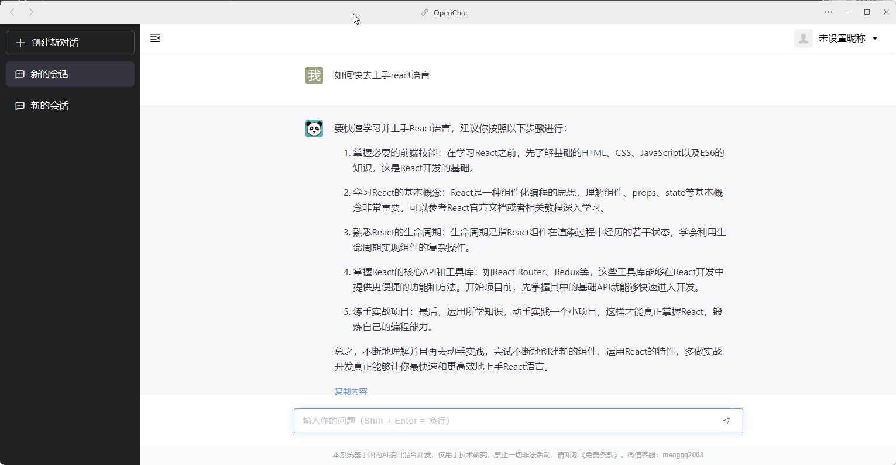
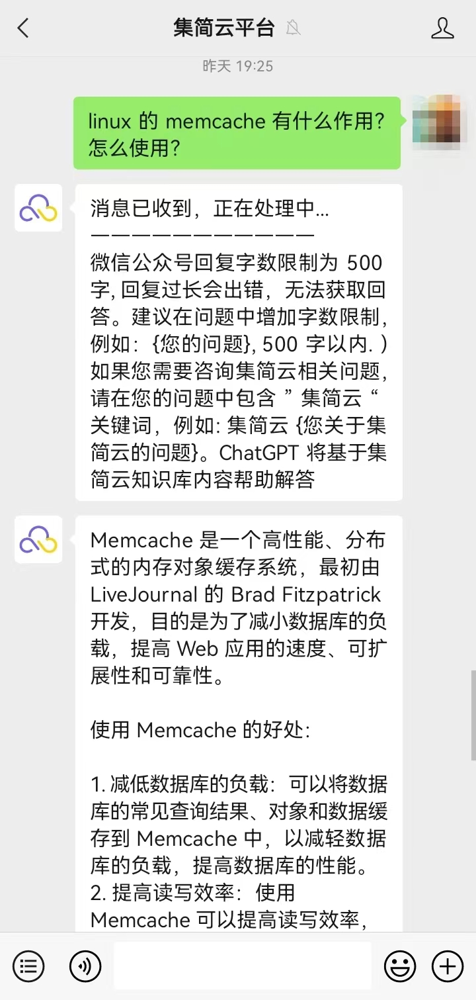

中文 | [English](README.md)

分享AI的一些有趣应用想法，收藏AI相关的实用工具，欢迎提交issues 或者pull requests。

## 全部分类
- [中国国内免费的AI chatGPT 问答站点](#中国国内免费的AI-chatGPT-问答站点，你的问题可得到解答)
- [免费的AI GPT 问答站点](#免费的AI-GPT-问答站点)

- [ChatGPT应用](#ChatGPT应用)
- [AI生成图片的资源](#AI-生成图片)
- [AutoGPT应用](#AutoGPT应用)
- [AI辅助快速开发软件](#AI-辅助快速开发软件)

## 中国国内免费的AI chatGPT 问答站点，你的问题可得到解答
- [openaichat.cc](https://m.openaichat.cc/web/)
    - AI GPT chat website, you can chat with AI, and get answers for your questions. free of charge. no limit of chat times.
    
- chatGPT-based on WeChat Official Account, by question chatting to this account: "集简云平台" 
- [openaichat.cc](https://m.openaichat.cc/web/)
    - 这是一家免费的 AI GPT 问答站点，您可以通过该站点与人工智能聊天，并获得您的问题的答案。无需付费，提问次数没有限制。
    
- 基于微信公众号的 ChatGPT，通过向账号“集简云平台”发送问题进行问答交流。
    
## ChatGPT应用
- [ChatGPT 提示词生成](https://github.com/f/awesome-chatgpt-prompts) 
    - 一个用于生成ChatGPT提示词的工具，可以用于生成聊天、对话、问答等各种应用。
- [ChatGPT 提示词快捷命令](https://www.aishort.top/)
    - 这是一个集成了大量 ChatGPT 提示的工具，可以用于生成各种应用场景的提示，例如聊天、对话、问答等。使用该工具无需付费，免费开放使用。[使用方法](https://www.aishort.top/docs)

## AI 生成图片
- [awesome-ai-painting](https://github.com/hua1995116/awesome-ai-painting)
    - 一个用于收藏AI生图相关的资源的仓库。

## AutoGPT应用
- [AutoGPT的官方github 地址](https://github.com/Significant-Gravitas/Auto-GPT)
    - AutoGPT是一个开源项目，使用gpt自主地实现你设定的任何目标。

| AutoGPT实例名称 | 解释 | 参考链接 |
| --- | --- | --- |
| Self-Improvement GPT | 由于AutoGPT可以执行代码，因此，一位网友创建了这样一个AutoGPT，让它读取文件，然后执行代码，如果出错，写入文件，然后读取错误信息，根据错误提示调整代码，实现代码自动debugging！ | [https://twitter.com/SigGravitas/status/1642181498278408193?s=20](https://twitter.com/SigGravitas/status/1642181498278408193?s=20) |
| Chef-GPT | 这个AutoGPT的目标就是挣钱，因此让它浏览各个财经网站，需按照投资机会，并执行 | [https://twitter.com/SigGravitas/status/1641437094043332614?s=20](https://twitter.com/SigGravitas/status/1641437094043332614?s=20) |
| EntreprenurGPT | 这个AutoGPT应该是创建web app，于是它去谷歌搜索如何安装Node开始，已知到最后执行 | [https://twitter.com/VarunMayya/status/1643902198164717569?s=20](https://twitter.com/VarunMayya/status/1643902198164717569?s=20) |
| AgentGPT | 这个是AutoGPT的网页版本，大家直接填写API Key就可以网页运行！ | [https://twitter.com/asimdotshrestha/status/1644883727707959296?s=20](https://twitter.com/asimdotshrestha/status/1644883727707959296?s=20) |
| GPT-Consult | 这个AutoGPT可以用来对市场进行仿真分析，然后完成自己的目标 | [https://twitter.com/emollick/status/1645609531240587265?s=20](https://twitter.com/emollick/status/1645609531240587265?s=20) |
| Full-Stack-GPT | 这个AutoGPT可以完成复杂的网站建设，包括设计网页、使用bootstrap美化，然后用flask托管等 | [https://twitter.com/SullyOmarr/status/1644750889432027136?s=20](https://twitter.com/SullyOmarr/status/1644750889432027136?s=20) |
| Research-GPT | 这个AutoGPT可以做科技产品的研究，获取市场最火热的5个耳机，然后分析价格等因素进行比较，自动生成研究报告 | [https://twitter.com/sairahul1/status/1646360595141206016?s=20](https://twitter.com/sairahul1/status/1646360595141206016?s=20) |
| Self-Improvement GPT | 由于AutoGPT可以执行代码，因此，一位网友创建了这样一个AutoGPT，让它读取文件，然后执行代码，如果出错，写入文件，然后读取错误信息，根据错误提示调整代码，实现代码自动debugging！ | [https://twitter.com/SigGravitas/status/1642181498278408193?s=20](https://twitter.com/SigGravitas/status/1642181498278408193?s=20) |
| Chef-GPT | 这个AutoGPT的目标就是挣钱，因此让它浏览各个财经网站，需按照投资机会，并执行 | [https://twitter.com/SigGravitas/status/1641437094043332614?s=20](https://twitter.com/SigGravitas/status/1641437094043332614?s=20) |
| EntreprenurGPT | 这个AutoGPT应该是创建web app，于是它去谷歌搜索如何安装Node开始，已知到最后执行 | [https://twitter.com/VarunMayya/status/1643902198164717569?s=20](https://twitter.com/VarunMayya/status/1643902198164717569?s=20) |
| AgentGPT | 这个是AutoGPT的网页版本，大家直接填写API Key就可以网页运行！ | [https://twitter.com/asimdotshrestha/status/1644883727707959296?s=20](https://twitter.com/asimdotshrestha/status/1644883727707959296?s=20) |
| GPT-Consult | 这个AutoGPT可以用来对市场进行仿真分析，然后完成自己的目标 | [https://twitter.com/emollick/status/1645609531240587265?s=20](https://twitter.com/emollick/status/1645609531240587265?s=20) |
| Full-Stack-GPT | 这个AutoGPT可以完成复杂的网站建设，包括设计网页、使用bootstrap美化，然后用flask托管等 | [https://twitter.com/SullyOmarr/status/1644750889432027136?s=20](https://twitter.com/SullyOmarr/status/1644750889432027136?s=20) |
| Research-GPT | 这个AutoGPT可以做科技产品的研究，获取市场最火热的5个耳机，然后分析价格等因素进行比较，自动生成研究报告 | [https://twitter.com/sairahul1/status/1646360595141206016?s=20](https://twitter.com/sairahul1/status/1646360595141206016?s=20) |

## AI 辅助快速开发软件
- 编程助手
    - github copilot
        - 一个由github和openai合作开发的编程助手，可以通过输入注释，自动生成代码。
        - [github copilot官网](https://copilot.github.com/)
- AI辅助前端开发
    - [阿里巴巴imagecook]( https://www.imagecook.com/)
        - 一个可以通过AI辅助前端开发的工具，可以通过上传图片，自动生成前端代码，可以用于快速开发网页。

    - [AppWorks](https://appworks.site)
        - 基于 VS Code 插件的前端研发工具集，让前端开发更快更好更轻松。
            - 特色：
                - 海量物料提供多种垂直领域模板和区块，快速创建项目，支持风格切换，满足个性化需求。
                - 支持边修改边看前端效果（npm run start）。

    -
## License
- [CC0 1.0 Universal](https://creativecommons.org/publicdomain/zero/1.0/deed.en)